<div align="center">

[](https://git.io/typing-svg)

# Travis Beckwith, PhD

### Neuroimaging · MRI Pipelines · Longitudinal Data · Reproducible Science

[](https://travisbeckwith.github.io/CV)
[](https://www.researchgate.net/profile/Travis_Beckwith)
[](https://orcid.org/0000-0001-6128-8464)
[](https://scholar.google.com/citations?user=wolY848AAAAJ&hl=en)
[](mailto:travis.beckwith@gmail.com)

</div>

---

> *I turn my problems into programs. Neuroscience PhD. MRI pipelines, longitudinal data, reproducible science.*

15+ years extracting signal from complex biomedical and neuroimaging datasets — as principal neuroimaging analyst on three NIH-funded longitudinal cohorts, postdoctoral fellow in neurotrauma, and now as a neurotechnology adviser and AI domain expert. I build the infrastructure that makes analyses reproducible, not just the analyses.

**11 peer-reviewed publications · 390 citations · h-index: 10**

---

## 🧠 What I Work On

```
Multimodal MRI Analysis    →  fMRI · DTI · MRS · Volumetric
Pipeline Development       →  Containerized · HPC · BIDS-compliant
Longitudinal Modeling      →  Mixed-effects · MLM · Brain-behavior
AI & Neurotechnology       →  Model evaluation · Neurofeedback · Protocol design
```

---

## 🛠️ Tools & Pipelines

Organized by where each tool sits in a neuroimaging workflow — acquisition through analysis.

**Data Acquisition & Conversion**

| Project | Description | Stack |
|---|---|---|
| [**BIDS_convert**](https://github.com/TravisBeckwith/BIDS_convert) | DICOM-to-BIDS converter across all major modalities with parallel processing and provenance archival | Shell |

**Processing Pipelines**

| Project | Description | Stack |
|---|---|---|
| [**dwiforge**](https://github.com/TravisBeckwith/dwiforge) | ML-enhanced DTI processing pipeline with checkpointing, structured logging, and automated QC — methods paper in preparation | Shell · Python |

**Extraction & Tabulation**

| Project | Description | Stack |
|---|---|---|
| [**fsglean**](https://github.com/TravisBeckwith/fsglean) | BIDS-aware extraction of FreeSurfer stats into tidy, longitudinal tables | Python |
| [**QSI-extract**](https://github.com/TravisBeckwith/QSI-extract) | BIDS-aware extraction of NODDI and DTI scalars from QSIPrep/QSIRecon into tidy longitudinal tables, with NODDI assumption auditing and QC propagation | Python |

**Statistical Analysis**

| Project | Description | Stack |
|---|---|---|
| [**neuromediate**](https://github.com/TravisBeckwith/neuromediate) | Mediation analysis framework for MRI data | Python |

**Novel Methods & Simulation**

| Project | Status | Description | Stack |
|---|---|---|---|
| [**SMILD**](https://github.com/TravisBeckwith/SMILD) | 🚧 Active — POC validated; production two-branch solver (RotInv/LEMONADE) and ABCD Study validation in progress | Novel voxelwise reliability measure for the Standard Model diffusion-MRI degeneracy — quantifies whether biophysical microstructure estimates (NODDI, SMT, WMTI) are actually identifiable from the data. Theory paper in `docs/` | Python |
| [**NERVES**](https://github.com/TravisBeckwith/NERVES) | ✅ Verified — core NDE math independently checked 3 ways; 2 real bugs found & fixed (report-writing crash, FA mislabeling); CI added | Normalized Entropy Representation of Voxelwise Eigenvalue Spectra for microstructural diffusion mapping | Python |
| [**kinetispect**](https://github.com/TravisBeckwith/kinetispect) | 🚧 Active | fMRS simulator for functional magnetic resonance spectroscopy | — |

**Infrastructure & Utilities**

| Project | Description | Stack |
|---|---|---|
| [**NeuroRig**](https://github.com/TravisBeckwith/NeuroRig) | Assess your system's ability to run common MRI processing software | Python |

**Other Research Tooling**

| Project | Description | Stack |
|---|---|---|
| [**surveykit-ml**](https://github.com/TravisBeckwith/surveykit-ml) | Statistical analysis and machine learning toolkit for survey data — factor analysis, reliability testing, group comparisons, and classification/clustering for reproducible research pipelines | Python |

---

## 📄 Selected Publications

**Beckwith TJ**, Dietrich KN, Wright JP, Altaye M, Cecil KM. (2021). Criminal arrests associated with reduced regional brain volumes in an adult population with documented childhood lead exposure. *Environmental Research*, 201: 111559.
[](https://doi.org/10.1016/j.envres.2021.111559)

**Beckwith T**, Cecil K, Altaye M, et al. (2020). Reduced gray matter volume and cortical thickness associated with traffic-related air pollution in a longitudinally studied pediatric cohort. *PLOS ONE*, 15(1): e0228092.
[](https://doi.org/10.1371/journal.pone.0228092)
Altmetric Attention Score 425 (top 5% of all research outputs); covered by Reuters, Daily Mail, and ScienceDaily.

**Beckwith TJ**, Dietrich KN, Wright JP, Altaye M, Cecil KM. (2018). Reduced regional volumes associated with total psychopathy scores in an adult population with childhood lead exposure. *Neurotoxicology*, 67: 1–26.
[](https://doi.org/10.1016/j.neuro.2018.04.004)

---

## 📊 GitHub Stats

<div align="center">



</div>

---

## 🔬 Core Stack

**Neuroimaging:** FSL · AFNI · FreeSurfer · fMRIPrep · SPM · MRtrix3 · ANTs · dipy

**Programming:** Python · R · MATLAB · Bash · SQL

**Infrastructure:** Docker · Singularity · HPC/SLURM · BIDS · Git

**Statistics:** Mixed-effects models · GLM · Mediation · Multivariate methods · Longitudinal trajectory analysis

**Languages:** English (native) · Spanish (basic)

---

## 📍 Currently

- 🧬 **Neurotechnology Adviser** @ [MetaBrain Labs](https://metabrainlabs.com) — Pilot study design and neuroscience integration for an AI-powered cognitive performance platform
- 🤖 **Subject Matter Expert (Oracle)** @ [Outlier](https://outlier.ai) — Neuroscience and biomedical AI model training and evaluation
- 🔭 Building open-source neuroimaging infrastructure

---

<div align="center">

*Open to research scientist and imaging scientist roles at the intersection of rigorous science and real decisions.*

[](https://www.linkedin.com/in/travisbeckwith-phd)

</div>
